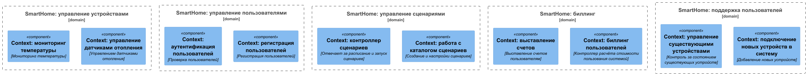
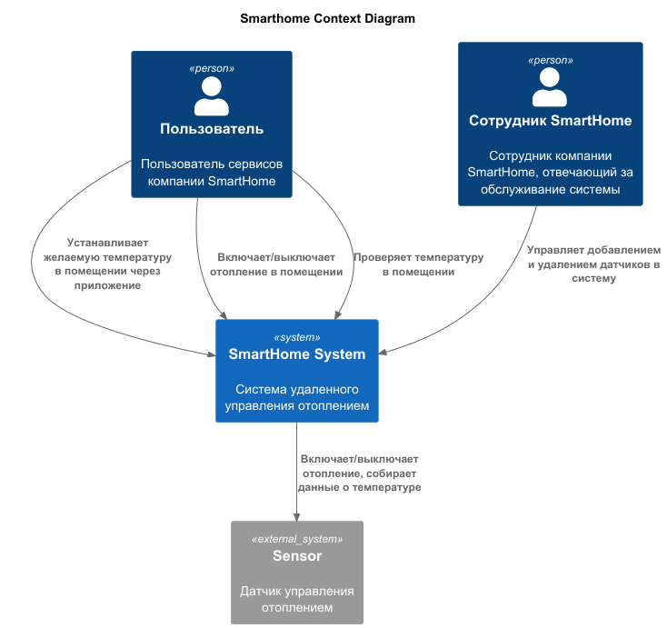
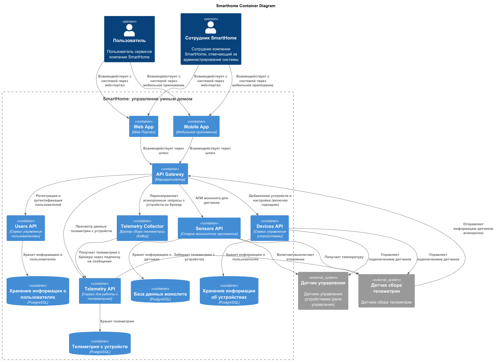
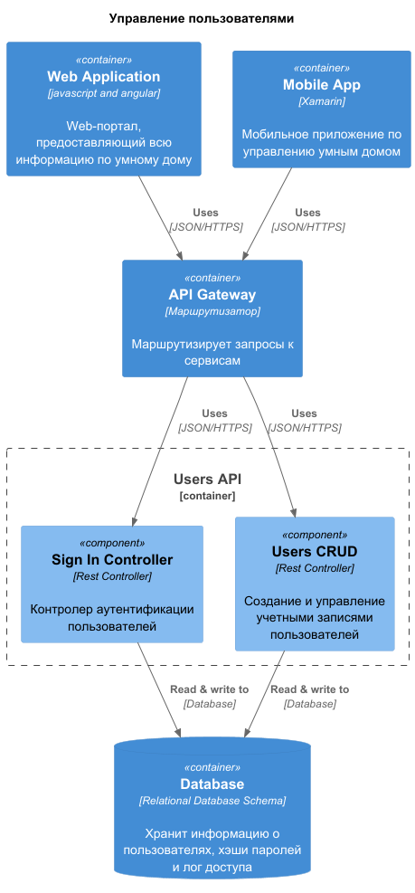
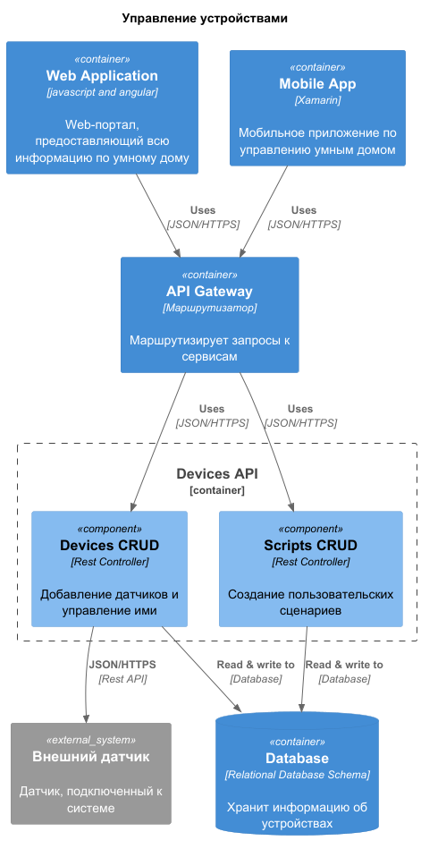
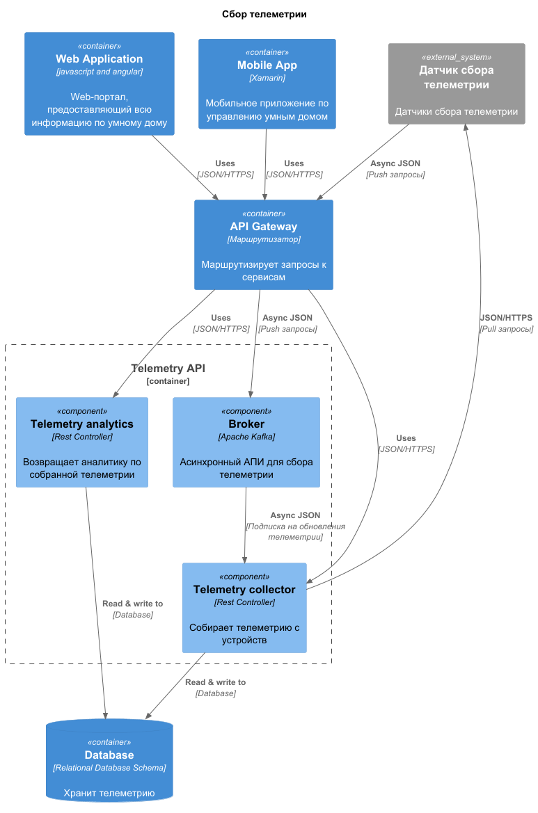
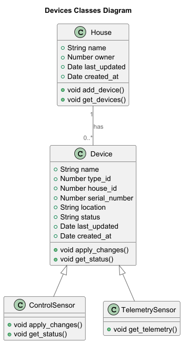
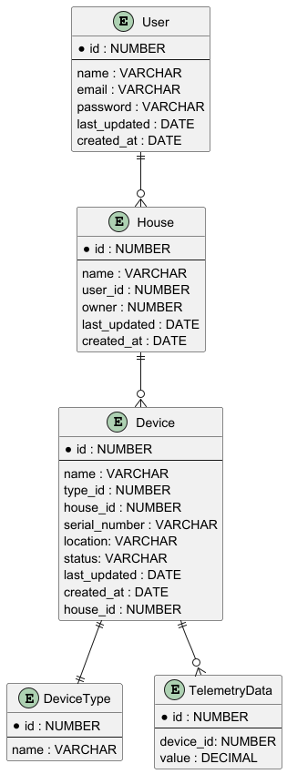

# Спринт 1

Решение проектной работы по кейсу "Умный дом".

# Задание 1. Анализ и планирование

### 1. Описание функциональности монолитного приложения

**Управление отоплением:**

- Пользователи могут управлять отоплением в доме, выставляя нужную температуру в системе.
- Пользователь не может самостоятельно подключить систему отопления в доме к системе. Подключение осуществляется специалистом по обслуживанию клиентов. 

**Мониторинг температуры:**

- Пользователи могут проверять температуру в доме.
- Пользователи могут выставить целевое значение температуры, но не могут его посмотреть. Текущий АПИ всегда выдаёт только текущую температуру в помещении.

### 2. Анализ архитектуры монолитного приложения

Архитектура приложения представляет из себя монолит на Go с СУБД Postgres. Всё синхронно. Никаких асинхронных вызовов, микросервисов и реактивного взаимодействия в системе нет. Всё управление идёт от сервера к датчику. Данные о температуре также получаются через запрос от сервера к датчику

### 3. Определение доменов и границы контекстов

Домен - управление умным домом. Текущее приложение реализует только часть функционала - управление отоплением. Можно выделить два контекста - мониторинг температуры и управление датчиками отопления.



### **4. Проблемы монолитного решения**

- Текущая схема не даёт пользователю добавлять и настраивать датчики самостоятельно. Для этого нужно обращаться к обсуживающему персоналу.
- Приложение не покрывает все потребности бизнеса. Есть необходимость расширять функционал приложения - добавлять датчики новых типов.
- Трудности масштабирования приложения при росте числа пользователей.

### 5. Визуализация контекста системы — диаграмма С4



# Задание 2. Проектирование микросервисной архитектуры

В этом задании вам нужно предоставить только диаграммы в модели C4. Мы не просим вас отдельно описывать получившиеся микросервисы и то, как вы определили взаимодействия между компонентами To-Be системы. Если вы правильно подготовите диаграммы C4, они и так это покажут.

**Диаграмма контейнеров (Containers)**



**Диаграмма компонентов (Components)**







**Диаграмма классов для сервиса Devices++



# Задание 3. Разработка ER-диаграммы

Добавьте сюда ER-диаграмму. Она должна отражать ключевые сущности системы, их атрибуты и тип связей между ними.



# Задание 4. Создание и документирование API

### 1. Тип API

В первой итерации будем использовать взаимодействие по протоколу HTTPS/JSON с использованием REST API. Выбран как наиболее простой способ для быстрой реализации. В дальнейшем можно рассмотреть другие механизмы. Проблемное место - сбор телеметрии. Для асинхронного взаимодействия будем использовать брокер для сбора данных.

В документацию API добавлены два описания: 1. Описание синхронного REST API сервиса телеметрии и описание асинхронной ручки для сбора телеметрии. 

### 2. Документация API

- **[Документация для REST API Телеметрии](./apps/telemetry_api/openapi.yaml)**
- **[Документация для асинхронного сервиса сбора Телеметрии](./apps/telemetry_api/asyncapi.yaml)**

# Задание 5. Работа с docker и docker-compose

Перейдите в apps.

Там находится приложение-монолит для работы с датчиками температуры. В README.md описано как запустить решение.

Вам нужно:

1) сделать простое приложение temperature-api на любом удобном для вас языке программирования, которое при запросе /temperature?location= будет отдавать рандомное значение температуры.

Locations - название комнаты, sensorId - идентификатор названия комнаты

```
	// If no location is provided, use a default based on sensor ID
	if location == "" {
		switch sensorID {
		case "1":
			location = "Living Room"
		case "2":
			location = "Bedroom"
		case "3":
			location = "Kitchen"
		default:
			location = "Unknown"
		}
	}

	// If no sensor ID is provided, generate one based on location
	if sensorID == "" {
		switch location {
		case "Living Room":
			sensorID = "1"
		case "Bedroom":
			sensorID = "2"
		case "Kitchen":
			sensorID = "3"
		default:
			sensorID = "0"
		}
	}
```

2) Приложение следует упаковать в Docker и добавить в docker-compose. Порт по умолчанию должен быть 8081

3) Кроме того для smart_home приложения требуется база данных - добавьте в docker-compose файл настройки для запуска postgres с указанием скрипта инициализации ./smart_home/init.sql

Для проверки можно использовать Postman коллекцию smarthome-api.postman_collection.json и вызвать:

- Create Sensor
- Get All Sensors

Должно при каждом вызове отображаться разное значение температуры

Ревьюер будет проверять точно так же.

Указанный сервис на языке Go уже был добавлен в шаблон задания на сайте Практикума. Была необходимость только прописать настройки в docker-compose, запустить и проверить сервис.

# **Задание 6. Разработка MVP**

Необходимо создать новые микросервисы и обеспечить их интеграции с существующим монолитом для плавного перехода к микросервисной архитектуре. 

### **Что нужно сделать**

1. Создайте новые микросервисы для управления телеметрией и устройствами (с простейшей логикой), которые будут интегрированы с существующим монолитным приложением. Каждый микросервис на своем ООП языке.
2. Обеспечьте взаимодействие между микросервисами и монолитом (при желании с помощью брокера сообщений), чтобы постепенно перенести функциональность из монолита в микросервисы. 

В результате у вас должны быть созданы Dockerfiles и docker-compose для запуска микросервисов. 
